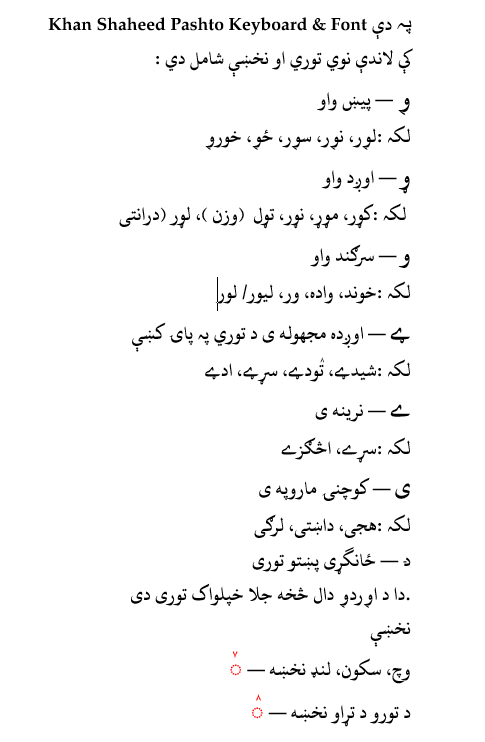
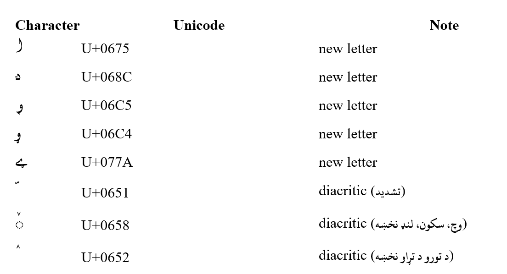

# Khan-Shaheed-Pashto-Font-by-Dr-Sarwar
Khan Shaheed Pashto Font & Keyboard
by Dr. Sarwar
Version 1.0 — 2025

Description:
This font and keyboard layout are specially designed for the Pashto language.
They include five additional letters and important diacritical signs
that were originally proposed  and published by Khan Shaheed in 1956 but could not be used
because there was no proper keyboard and font support.

  
  
This project makes it possible for the first time to read and write Pashto clearly and correctly with all essential letters and signs.

Author :
Dr. Ghulam Sarwar: 
Deragai, Zhob District, Pakistan
Current Residence: Mainz, Germany

Email: doc.sarwar15@gmail.com
Copyright © 2025 by Dr. Ghulam Sarwar. All rights reserved.

License:
This font is licensed under the Creative Commons
Attribution-NoDerivatives 4.0 International License (CC BY-ND 4.0).
You may use and share this font freely, provided that you give
appropriate credit to the author and do not modify the font files.

Included files:
- KhanShaheedPashtoFont.ttf
- KhanShaheedPashtoKeyboard.zip
- LICENSE.txt
- Preview.png
  
Installation (Windows)
1. Download and extract the ZIP file.
2. Install the font:
   - Right-click KhanShaheedPashtoFont.ttf
   - Select Install or Install for all users
3. Install the keyboard:
   - Extract KhanShaheedPashtoKeyboard.zip
   - Run the installer
4. Add the keyboard via:
   Windows Settings → Time & Language → Language → Pashto (This step will be skipped in Windows 10 & 11)
   
Select Khan Shaheed Pashto Keyboard and start typing.
